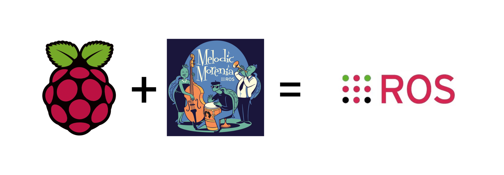

# Control y simulación de un prototipo de articulación.
---
||
|:--:|
| <b> Fig. 1 - ROS + Raspberry. </b>|

En este proyecto se integra una articulación, un microcontrolador Arduino, una Raspberry Pi y la plataforma ROS (Robot Operating System) para crear un sistema completo de robótica. El objetivo final es desarrollar un módulo didáctico que pueda ser utilizado para enseñar robótica de manera práctica e interactiva potenciado por herramientas de código abierto.

El objetivo consiste en la simulación de una articulación que pueda ser controlada a través de comandos enviados desde la Raspberry Pi por el puerto serie al microcontrolador Arduino MEGA 2560, utilizando ROS como plataforma de control. La simulación se ejecuta en RViz, un simulador de robots que permite observar el comportamiento de la articulación en tiempo real.

En este repositorio se encuentran los archivos necesarios para la instalación y ejecución de la simulación final con todos los componentes integrados. Se incluyen instrucciones detalladas para la instalación de ROS, la configuración de la Raspberry Pi y el Arduino, y para la ejecución de la simulación en RViz.

Consultalo en el siguiente orden:

- [1. Instalación y configuración de ROS Melodic.](/docs/Instalación_ROS_Melodic.md)
- [2. Simulación y comunicación con Arduino.](/docs/Simulación&Com_Arduino_ROS.md)
- [3. Simulación final.](/docs/Simulación_Final.md)

---
## Recursos extra:
- [1. QtSerialMonitor.](https://github.com/mich-w/QtSerialMonitor) 💻
- [2. Documentación de SimpleFOC.](https://docs.simplefoc.com/) 📃
- [3. Comandos para controlar e interactuar con el motor.](https://docs.simplefoc.com/commander_motor) 📄
- [4. Diagrama general de conexiones del hardware.](/docs/Diagrama_general_conexiones.pdf) 🔌
- [5. Documentación de ROS.](http://wiki.ros.org/es) 🤖

📣 Esperando que este recurso sea útil para todas aquellas personas interesadas en aprender robótica. Cualquier duda, comentario o sugerencia, es bienvenid@.
😊