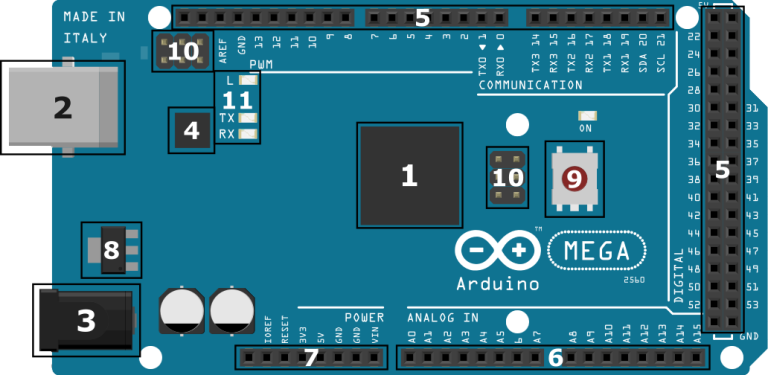
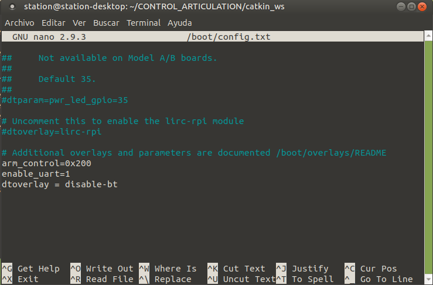

# Simulación final.
En esta última simulación se integrarán los siguientes elementos:
* Articulación completamente armada.
* La comunicación de ROS con el Arduino.
* La visualización en tiempo real en RViz.


- [Simulación final.](#simulación-final)
  - [1. Programación inicial de Arduino.](#1-programación-inicial-de-arduino)
  - [2. Configuración de la Raspberry Pi.](#2-configuración-de-la-raspberry-pi)
    - [2.1 RQT.](#21-rqt)
    - [2.3 Cutecom.](#23-cutecom)
  - [3. Control por comandos.](#3-control-por-comandos)
    - [3.1 Arduino.](#31-arduino)
    - [3.2 Script Python.](#32-script-python)
  - [4. Control por ROS.](#4-control-por-ros)
  - [Se implementó un suscriptor en el Arduino que permitía recibir mensajes publicados en el tópico "/joint\_states" de ROS. A diferencia de lo que se esperaba, se notó que la comunicación no se desincronizaba y el suscriptor funcionaba de manera correcta. Esto hizo que el proceso de comunicación fuera más sencillo y rápido de realizar.](#se-implementó-un-suscriptor-en-el-arduino-que-permitía-recibir-mensajes-publicados-en-el-tópico-joint_states-de-ros-a-diferencia-de-lo-que-se-esperaba-se-notó-que-la-comunicación-no-se-desincronizaba-y-el-suscriptor-funcionaba-de-manera-correcta-esto-hizo-que-el-proceso-de-comunicación-fuera-más-sencillo-y-rápido-de-realizar)
    - [4.1 Arduino.](#41-arduino)
    - [4.2 Script Python.](#42-script-python)
  - [5. Videotutorial de la sección.](#5-videotutorial-de-la-sección)


## 1. Programación inicial de Arduino.
Con el siguiente programa, se pretende hacer que el Arduino MEGA 2560 pueda comunicarse a través del puerto serial USB (Componente 2 de la Figura 1) con ROS. Es importante tener en cuenta que se deben instalar previamente las librerías SimpleFOC y rosserial.:

||
|:--:|
| <b> Fig. 1 - Partes del Arduino MEGA 2560. </b>|
```
#include <SimpleFOC.h> // Incluimos la librería SimpleFOC.
#include <ros.h> // Incluimos la librería ROS.
#include <sensor_msgs/JointState.h> // Incluimos la librería JointState.

ros::NodeHandle  nodo; //Creamos el nodo.
sensor_msgs::JointState joint_msg; // Crea un mensaje JointState.
ros::Publisher joint_state_pub("/joint_states", &joint_msg); // Crea un publicador para el mensaje.

//---------------------Instanciamos los elementos del hardware---------------------
MagneticSensorSPI sensor = MagneticSensorSPI(48, 14, 0x3FFF);
// MagneticSensorSPI(int cs, float resolución, int registro_angulo)
// Instanciamos el objeto sensor Magnético con los siguientes parámetros:
// cs - Pin de selección del chip SPI conectado al Arduino.
// bit_resolution - Resolución del sensor magnético.
// angle_register - Registro de lectura de ángulo. (Consultar el manual del fabricante :D)

BLDCMotor motor = BLDCMotor(8,0.066,1320);
// BLDCMotor(int pp, int Ω, int KV)
// - pp             - número de pares de polos del motor.
// - Ω              - resistencia de fase del motor.
// - KV             - RPM/volt del motor. (Consultar el manual del fabricante :D)

BLDCDriver3PWM driver = BLDCDriver3PWM(11,9,10,6,3,5);
// BLDCDriver3PWM(int phA, int phB, int phC, int enA, int enB, int enC)
// - phA, phB, phC - pines PWM de fase A, B y C.
// - enA, enB, enC - pin de habilitación para cada fase.

// Lineas para comandar, al motor. Disponibilidad de todos los comandos, por medio del serial1.
Commander command = Commander(Serial1);
void doMotor(char* cmd) { command.motor(&motor, cmd); }


void setup(){
  // ------------------------ ROS ------------------------//
  nodo.getHardware()->setBaud(9600); // Velocidad de comunicación Arduino - ROS.
  nodo.initNode(); //Inicializamos el nodo.
  nodo.advertise(joint_state_pub); // Instanciamos un publicador con el nombre "joint_state_pub".
  
  // -------------------- SimpleFOC --------------------//

  // Inicializamos el sensor magnético, y lo asociamos al motor.
  sensor.init();
  motor.linkSensor(&sensor);
  
  //Configuramos la frecuencia a la que trabajará el pwm [Hz].
  driver.pwm_frequency = 2500;
  // Configuramos la velocidad del puerto de control [bps].
  Serial1.begin(9600);
  // Voltaje de la fuente de poder [V].
  driver.voltage_power_supply = 12;
  
  // Iniciamos el driver.
  driver.init();
  motor.linkDriver(&driver);

  //Ingresamos el limite de corriente y de velocidad.
  motor.current_limit = 15; // [Amperios]
  motor.velocity_limit = 20; // [rad/s]

  // Configuramos el tipo de control en este caso, control de ángulo.
  motor.controller = MotionControlType::angle;

  // Configuración del PI de velocidad.
  motor.PID_velocity.P = 0.5f;
  motor.PID_velocity.I = 20;
  motor.PID_velocity.D = 0;

  // Configuración del control del ángulo. 
  motor.P_angle.P = 1;
  // Se inicializa el motor.
  motor.init();
  // Se inicializa el control FOC del motor.
  motor.initFOC();
  // Setpoint de la posición inicial.
  motor.target = 0;
  // Se agrega el comando 'M' para enviar comandos al motor a través del puerto serial.
  command.add('M',doMotor,"motor");
  _delay(1000);
}

void loop(){
  // Llamamos a la función.
  configurar_mensaje_juntas();
  // Publicamos el mensaje.  
  joint_state_pub.publish(&joint_msg);
  // Función principal del algoritmo FOC.
  motor.loopFOC();
  // Función de control de movimiento.
  motor.move();
  // Comunicación con el usuario.
  command.run();
  // Función necesaria para que el nodo pueda recibir y enviar mensajes.
  nodo.spinOnce();
  delay(500);
}

void configurar_mensaje_juntas(){
  /* En esta función le damos forma al mensaje a enviar a ROS;*/
  // Establecemos la marca temporal del mensaje en el momento actual.
  joint_msg.header.stamp = nodo.now();
  // Definimos el número de juntas del robot, en este caso solo tenemos una.
  joint_msg.name_length = 1;
  joint_msg.position_length = 1;
  joint_msg.velocity_length = 1;
  // Creamos los arreglos necesarios para almacenar la información de la junta.
  joint_msg.name = new char*[1];
  joint_msg.position = new float[1];
  joint_msg.velocity = new float[1];
  // Asignamos el nombre y los valores de posición y velocidad de la junta.
  joint_msg.name[0] = "Revolute_2";
  joint_msg.position[0] = motor.shaft_angle;
  joint_msg.velocity[0] = motor.shaft_velocity;
}
```
En la primera parte del código se importan las librerías necesarias: SimpleFOC.h para la librería SimpleFOC, ros.h para ROS y sensor_msgs/JointState.h para el mensaje JointState.

Después se crea el nodo, el mensaje JointState y el publicador para el mensaje. El mensaje JointState es un mensaje común en ROS para enviar información de posición, velocidad y esfuerzo de una o varias juntas en un robot.

En la siguiente sección se instancian los elementos de hardware, como el sensor magnético, el motor y el driver BLDCDriver3PWM. Se define la frecuencia PWM, la velocidad de la fuente de poder y los límites de corriente y velocidad del motor. También se configura el tipo de control en este caso, control de ángulo. Finalmente, se inicializa el motor y el control FOC del motor.

En el loop se llama la función configurar_mensaje_juntas() para configurar el mensaje JointState a enviar a ROS. Luego, se publica el mensaje utilizando el publicador joint_state_pub. A continuación, se ejecutan las funciones loopFOC(), move() y monitor() del motor para el control FOC. También se ejecuta la función run() del objeto command para recibir comandos por el puerto serial. Finalmente, se llama la función spinOnce() para que el nodo pueda recibir y enviar mensajes y se utiliza un delay(500) para evitar sobrecargar la comunicación.

La función configurar_mensaje_juntas() establece la marca temporal del mensaje, define el número de juntas (en este caso solo una), crea los arreglos necesarios para almacenar la información de la junta y asigna la información de la posición, velocidad y esfuerzo del motor al mensaje JointState.

Con lo anterior nuestro Arduino se encuentra listo para conectarse a la Raspberry Pi.

---
## 2. Configuración de la Raspberry Pi.
Debido a que estamos utilizando el puerto USB del Arduino MEGA para la comunicación con ROS a través de rosserial, no podemos usarlo para otras tareas. Por lo tanto, para enviar los parámetros como el "setpoint" del ángulo, utilizaremos el puerto Serial1, que se encuentra en los pines TX1 y RX1, en el codigo anterior ya se configuro el puerto (línea 29 y 95).

Aunque esta situación se soluciona rápidamente con el Arduino, en el caso de la Raspberry Pi es necesario habilitar el puerto serial de la interfaz GPIO (ver Fig. 2).
||
|:--:|
| <b> Fig. 2 - Conexión Arduino - Interfaz GPIO. </b>|

Esto nos permitirá realizar la comunicación de manera efectiva con el motor sin interferir el uso del puerto USB para la comunicación con ROS.

Para habilitar el puerto realizamos lo siguiente:
1. Abre la terminal de la Raspberry Pi.
2. Ingresa el siguiente comando para abrir la configuración de Raspberry Pi:
```
sudo raspi-config
```
3. Usa las teclas de flecha en el teclado para seleccionar "Interfacing Options" (Opciones de Interfaz) en el menú.

4. Luego, selecciona "Serial". Aparecerá un mensaje preguntándote: **Would you like a login shell to be accessible over serial?**. Selecciona "No", después te preguntará: **Would you like the serial port hardware to be enabled?**, selecciona "Yes".

5. Al finalizar el paso anterior, selecciona la opción "Finish". Ahora te preguntará si quieres reiniciar. Selecciona "No", ya que antes haremos otros ajustes.

**Nota:** En la Raspberry Pi 3 Model B, B+, 4 y Raspberry Pi Zero W existen dos controladores UART que pueden ser utilizados para la comunicación serial, el mini UART y el PL011 UART. Por defecto, el mini UART está mapeado en el TXD (GPIO 14) y RXD (GPIO 15) en el puerto GPIO de 40 pines y el PL011 UART se utiliza para el módulo inalámbrico/Bluetooth, pero cualquiera de los dos módulos se puede mapear en el puerto GPIO.

El puerto mini UART se puede acceder utilizando el dispositivo **/dev/ttyS0** en Linux. Un problema con el controlador mini UART es que su velocidad de baudios está vinculada a la frecuencia del núcleo VPU, por lo que a medida que la frecuencia del VPU cambia según la carga del procesador, también lo hace la velocidad de baudios del controlador UART. Esto causará problemas ya que los dispositivos seriales esperan una velocidad de baudios constante durante la comunicación.

Para solucionar este problema, la frecuencia del núcleo VPU debe ser fijada, lo que puede limitar la velocidad de la Raspberry Pi o aumentar el consumo de energía y el calor generado dependiendo de la velocidad a la que se establezca la frecuencia del núcleo.

El controlador mini UART tiene un búfer FIFO más pequeño que el controlador PL011 UART. Esto puede causar problemas a velocidades de baudios más altas ya que hace que sea más probable perder caracteres.

El controlador PL011 UART no está vinculado a la frecuencia del núcleo VPU. Esto significa que la velocidad de baudios permanece igual independientemente de la velocidad del VPU. El controlador PL011 UART también incluye otras características no presentes en el controlador mini UART, como detección de errores de trama, detección de errores de interrupción de tiempo de recepción y soporte de bits de paridad.

La principal desventaja de usar el controlador PL011 UART es que **desactiva el módulo Bluetooth/inalámbrico**, por lo que no se podrá utilizar las funciones Bluetooth de la Raspberry Pi 3 y Zero W.

Se recomienda utilizar el controlador PL011 UART cuando se requiere una conexión de datos confiable, un consumo de energía y velocidad de procesamiento son una prioridad.

Seguiremos las recomendaciones anteriores y modificaremos algunos archivos para que la Raspberry Pi desactive el módulo Bluetooth y mapee el puerto PL011 UART en los pines 14 y 15.

1. Abrimos el archivo /boot/config.txt para desactivar el módulo Bluetooth.
```
sudo nano /boot/config.txt
```

2. Agregamos al final del archivo lo siguiente:

```
dtoverlay=disable-bt
```
Salimos del editor usando **Ctrl + x** y guardamos los cambios, el resultado sería algo semejante a lo mostrado en la figura 3.

||
|:--:|
| <b> Fig. 3 - Archivo editado. </b>|

3. Abrimos el archivo "cmdline.txt" con el siguiente comando:

```
sudo nano /boot/cmdline.txt
```
4. Se mostrará algo semejante al texto de abajo:

```
dwc_otg.lpm_enable=0 console=serial0,115200 console=tty1 root=/dev/mmcblk0p2 rootfstype=ext4 elevator=deadline fsck.repair=yes root wait
```
5. Borramos el texto:
```
console=serial0,115200
```
El resultado se muestra en la figura 4, guardamos y salimos del editor:

||
|:--:|
| <b> Fig. 4 - Resultado. </b>|

---
### 2.1 RQT.
RQT es una herramienta de visualización y análisis de datos en tiempo real para ROS. Es un entorno gráfico que permite a los usuarios interactuar con los componentes de ROS, visualizar los datos publicados por los nodos, inspeccionar y modificar los parámetros de los nodos, y ejecutar y monitorear los servicios y acciones de ROS.  

Es necesario instalar RQT para visualizar las variables de posición y velocidad de la articulación, esta herramienta proporciona una interfaz gráfica fácil de usar que permite visualizar y monitorear en tiempo real los datos generados. La instalamos con el siguiente comando:

```
rosdep install rqt_plot
```
---
### 2.3 Cutecom.
La herramienta Cutecom es una aplicación de terminal que proporciona una interfaz gráfica para interactuar con dispositivos seriales. Es útil para depurar y monitorear dispositivos electrónicos que se comunican a través de un puerto serie, como es el caso de la comunicación entre la Raspberry Pi y el Arduino en nuestro proyecto.

Utilizaremos cutecom para enviar comandos al Arduino y para recibir datos de posición y velocidad de la articulación, lo que nos permite monitorear el movimiento del robot en tiempo real y verificar que todo esté funcionando correctamente. Su instalación es necesaria para realizar pruebas y depurar cualquier posible problema en la comunicación serie entre la Raspberry Pi y el Arduino.

```
sudo apt install cutecom
```

Esto seía todo procedemos a reiniciar el dispositivo.

```
sudo shutdown -r now
```
## 3. Control por comandos.
Durante el desarrollo del proyecto, se intentó utilizar la librería Rosseserial para establecer la comunicación entre el Arduino y ROS. Sin embargo, se encontraron problemas de inestabilidad en la conexión, lo que afectaba la transferencia de datos. Debido a esto, se decidió utilizar únicamente la comunicación serial nativa de Arduino y desarrollar un script en Python que publica las variables de posición y velocidad de la articulación al tópico "/joint_states" en ROS. Esta solución demostró ser más estable y confiable en comparación con el uso de Rosseserial, permitiendo una transferencia de datos fluida.

---
### 3.1 Arduino.
La programación del arduino ahora es la siguiente:
```
#include <SimpleFOC.h> // Incluimos la librería SimpleFOC.
//---------------------Instanciamos los elementos del hardware---------------------
MagneticSensorSPI sensor = MagneticSensorSPI(48, 14, 0x3FFF);
// MagneticSensorSPI(int cs, float resolución, int registro_angulo)
// Instanciamos el objeto sensor Magnético con los siguientes parámetros:
// cs - Pin de selección del chip SPI conectado al Arduino.
// bit_resolution - Resolución del sensor magnético.
// angle_register - Registro de lectura de ángulo. (Consultar el manual del fabricante :D)

BLDCMotor motor = BLDCMotor(8,0.066,1320);
// BLDCMotor(int pp, int Ω, int KV)
// - pp             - número de pares de polos del motor.
// - Ω              - resistencia de fase del motor.
// - KV             - RPM/volt del motor. (Consultar el manual del fabricante :D)

BLDCDriver3PWM driver = BLDCDriver3PWM(11,9,10,6,3,5);
// BLDCDriver3PWM(int phA, int phB, int phC, int enA, int enB, int enC)
// - phA, phB, phC - pines PWM de fase A, B y C.
// - enA, enB, enC - pin de habilitación para cada fase.

// Lineas para comandar, al motor. Disponibilidad de todos los comandos, por medio del serial1.
Commander command = Commander(Serial1);
void doMotor(char* cmd) { command.motor(&motor, cmd); }


void setup(){
  // -------------------- SimpleFOC --------------------//

  // Inicializamos el sensor magnético, y lo asociamos al motor.
  sensor.init();
  motor.linkSensor(&sensor);
  
  //Configuramos la frecuencia a la que trabajará el pwm [Hz].
  driver.pwm_frequency = 2500;
  // Configuramos la velocidad del puerto de monitoreo [bps].
  Serial.begin(115200);
  // Configuramos la velocidad del puerto de control [bps].
  Serial1.begin(115200);
  // Voltaje de la fuente de poder [V].
  driver.voltage_power_supply = 12;
  
  // Iniciamos el driver.
  driver.init();
  motor.linkDriver(&driver);

  //Ingresamos el limite de corriente y de velocidad.
  motor.current_limit = 15; // [Amperios]
  motor.velocity_limit = 20; // [rad/s]

  // Configuramos el tipo de control en este caso, control de ángulo.
  motor.controller = MotionControlType::angle;

  // Configuración del PI de velocidad.
  motor.PID_velocity.P = 0.5f;
  motor.PID_velocity.I = 20;
  motor.PID_velocity.D = 0;

  // Configuración del control del ángulo. 
  motor.P_angle.P = 1;
  // Se inicializa el motor.
  motor.init();
  // Se inicializa el control FOC del motor.
  motor.initFOC();
  // Setpoint de la posición inicial.
  motor.target = 0;
  // Variables a monitorear.
  motor.monitor_variables = _MON_TARGET | _MON_VEL | _MON_ANGLE;
  // Se agrega el comando 'M' para enviar comandos al motor a través del puerto serial.
  command.add('M',doMotor,"motor");
  // Activamos el monitoreo del motor en el puerto Serial1.
  motor.useMonitoring(Serial);
  Serial1.println("Configuracion terminada");
  _delay(1000);
}

void loop(){
  // Función principal del algoritmo FOC.
  motor.loopFOC();
  // Función de control de movimiento.
  motor.move();
  // Comunicación con el usuario.
  motor.monitor();
  command.run();
}
```

En cuanto a las modificaciones, estas fueron mínimas y consistieron principalmente en eliminar las funcionalidades relacionadas con ROS. Asimismo, se reasignó la tarea de monitoreo al puerto Serial y se utilizó el puerto Serial1 para la recepción de comandos.

---
### 3.2 Script Python.
El siguiente es el script de Python que se utiliza para publicar mensajes en el tópico "/joint_states" en ROS. Este script se encarga de leer los datos desde el puerto serie que está conectado a la placa de Arduino, los decodifica y luego los publica como mensajes de estado en ROS. Los mensajes contienen información sobre la posición, velocidad y esfuerzo de la articulación. Este script utiliza la biblioteca "serial" de Python para establecer la conexión serial con la placa de Arduino por ello es necesario instalarla antes de intentar correr el programa.

Librería pyserial:
```
pip install pyserial
```
Script:
```
#! /usr/bin/env python
# -*- coding: utf-8 -*-
import rospy
from sensor_msgs.msg import JointState
import serial

ser = serial.Serial(
        # Puerto serie a leer los datos
        port='/dev/ttyACM0',
 
        # Velocidad de transmisión de datos
        baudrate = 115200,
   
        # Paridad (ninguna en este caso)
        parity=serial.PARITY_NONE,
 
        # Bits de parada
        stopbits=serial.STOPBITS_ONE,
     
        # Número total de bits
        bytesize=serial.EIGHTBITS,
 
        # Número de comandos serie a aceptar antes de expirar
        timeout=2
)

def main():
    rospy.init_node("joint_state_publisher")
    pub = rospy.Publisher("/joint_states", JointState, queue_size=10)
    rate = rospy.Rate(10)
    while not rospy.is_shutdown():
        # Leer datos desde el puerto serie
        x = ser.readline().decode('utf-8') # Convierte los bytes a una cadena de texto
        values = x.strip().split("\t") # Elimina los caracteres especiales de la cadena de texto
        try:
            valor1 = float(values[0])  # Convierte el valor a float
            valor2 = float(values[1])  # Convierte el valor a float
            valor3 = float(values[2])  # Convierte el valor a float
        except ValueError:
            continue
        
        # Crea el mensaje
        joint_state_msg = JointState()
        joint_state_msg.header.stamp = rospy.Time.now()
        joint_state_msg.name = ["Revolute_2"]
        joint_state_msg.position = [round(valor3/100,4)]  # Publica posición
        joint_state_msg.velocity = [valor2]  # Publica velocidad
        joint_state_msg.effort = [valor1]  # PUblica esfuerzo
        
        
        # Publicar mensaje de estado
        pub.publish(joint_state_msg)
        rate.sleep()

if __name__ == '__main__':
    try:
        main()      
    except rospy.ROSInterruptException:
        pass
```

## 4. Control por ROS.
Durante la realización de este control, se utilizó la librería rosserial para recibir mensajes de ROS. A diferencia del control anterior, en esta ocasión no fue necesario utilizar el script en Python para realizar la comunicación.

Se implementó un suscriptor en el Arduino que permitía recibir mensajes publicados en el tópico "/joint_states" de ROS. A diferencia de lo que se esperaba, se notó que la comunicación no se desincronizaba y el suscriptor funcionaba de manera correcta. Esto hizo que el proceso de comunicación fuera más sencillo y rápido de realizar.
---
### 4.1 Arduino.
Los cambios en la programación de Arduino fueron los siguientes:

```
#include <SimpleFOC.h> // Incluimos la librería SimpleFOC.
#include <ros.h> // Incluimos la librería ROS.
#include <sensor_msgs/JointState.h> // Incluimos la librería JointState.

ros::NodeHandle  nodo; //Creamos el nodo.

//---------------------Instanciamos los elementos del hardware---------------------
MagneticSensorSPI sensor = MagneticSensorSPI(48, 14, 0x3FFF);
// MagneticSensorSPI(int cs, float resolución, int registro_angulo)
// Instanciamos el objeto sensor Magnético con los siguientes parámetros:
// cs - Pin de selección del chip SPI conectado al Arduino.
// bit_resolution - Resolución del sensor magnético.
// angle_register - Registro de lectura de ángulo. (Consultar el manual del fabricante :D)

BLDCMotor motor = BLDCMotor(8,0.066,1320);
// BLDCMotor(int pp, int Ω, int KV)
// - pp             - número de pares de polos del motor.
// - Ω              - resistencia de fase del motor.
// - KV             - RPM/volt del motor. (Consultar el manual del fabricante :D)

BLDCDriver3PWM driver = BLDCDriver3PWM(11,9,10,6,3,5);
// BLDCDriver3PWM(int phA, int phB, int phC, int enA, int enB, int enC)
// - phA, phB, phC - pines PWM de fase A, B y C.
// - enA, enB, enC - pin de habilitación para cada fase.

float joint_pos = 0.0; 
void jointStateCallback(const sensor_msgs::JointState& msg) {
  joint_pos = (msg.position[0]*100);  // Asignamos el valor de la junta a la variable joint_pos.
}
// Configuramos el suscriptor.
ros::Subscriber<sensor_msgs::JointState> jointStateSub("/joint_states", jointStateCallback);

void setup(){
  // -------------------- ROS --------------------//
  nodo.getHardware()->setBaud(115200); // Velocidad de comunicación Arduino - ROS.
  nodo.initNode(); //Inicializamos el nodo.
  nodo.subscribe(jointStateSub);
  
  // -------------------- SimpleFOC --------------------//

  // Inicializamos el sensor mágnetico, y lo asociamos al motor.
  sensor.init();
  motor.linkSensor(&sensor);
  
  //Configuramos la frecuencia a la que trabajará el pwm [Hz].
  driver.pwm_frequency = 2500;
  // Configuramos la velocidad del puerto de monitoreo [bps].
  Serial.begin(115200);
  // Configuramos la velocidad del puerto de control [bps].
  //
  
  //Serial1.begin(115200);
  // Voltaje de la fuente de poder [V].
  driver.voltage_power_supply = 12;
  
  // Iniciamos el driver.
  driver.init();
  motor.linkDriver(&driver);

  //Ingresamos el limite de corriente y de velocidad.
  motor.current_limit = 15; // [Amperios]
  motor.velocity_limit = 20; // [rad/s]

  // Configuramos el tipo de control en este caso, control de ángulo.
  motor.controller = MotionControlType::angle;

  // Configuración del PI de velocidad.
  motor.PID_velocity.P = 0.5f;
  motor.PID_velocity.I = 20;
  motor.PID_velocity.D = 0;

  // Configuración del control del ángulo. 
  motor.P_angle.P = 1;
  // Se inicializa el motor.
  motor.init();
  // Se inicializa el control FOC del motor.
  motor.initFOC();
  // Setpoint de la posición inicial.
  motor.target = 0;
  // Activamos el monitoreo del motor en el puerto Serial1.
  motor.useMonitoring(Serial1);
  // Variables a observar: Setpoint y ángulo.
  motor.monitor_variables = _MON_TARGET | _MON_ANGLE;
  Serial1.println("Configuracion terminada");
  _delay(1000);
}

void loop(){
  // Función principal del algoritmo FOC.
  motor.loopFOC();
  // Función de control de movimiento..
  motor.move(joint_pos);
  // Comunicación con el usuario.
  motor.monitor();
  nodo.spinOnce();
}
```
### 4.2 Script Python.
Aunque la programación anterior funciona sin problemas, en caso de presentar dificultades se deja a disposición del lector una implementación del script en Python que realiza la misma función que el código de Arduino anterior.De manera general el script es un nodo suscriptor de ROS que se suscribe al tópico "/joint_states" para recibir mensajes de estado conjunto de ROS. Cuando recibe un mensaje de estado conjunto, extrae la posición del primer joint del mensaje y la convierte a una cadena de caracteres con un formato específico. Luego, envía la posición del joint como una cadena de caracteres a través del puerto serie del Arduino.
```
#!/usr/bin/env python
# -*- coding: utf-8 -*-

import rospy
from sensor_msgs.msg import JointState
import serial

ser = serial.Serial(
    # Puerto serie al que enviar los datos
    port='/dev/ttyACM0',
 
    # Velocidad de transmisión de datos
    baudrate=115200,
   
    # Paridad (ninguna en este caso)
    parity=serial.PARITY_NONE,
 
    # Patrón de bits de parada
    stopbits=serial.STOPBITS_ONE,
     
    # Número total de bits
    bytesize=serial.EIGHTBITS,
 
    # Número de comandos serie a aceptar antes de expirar
    timeout=2
)

def joint_state_callback(msg):
    if len(msg.position) > 0:
        joint_pos = 'M' + str(round(msg.position[0]*100,3))  # Obtener posición del primer joint       
        # Enviar posición por el puerto serie
        ser.write(joint_pos.encode('utf-8') + b'\n')

def main():
    rospy.init_node("joint_state_subscriber")
    rospy.Subscriber("/joint_states", JointState, joint_state_callback)
    rospy.spin()

if __name__ == '__main__':
    try:
        main()      
    except rospy.ROSInterruptException:
        pass

```
Para correr los scripts de Python se hace mediante el comando:

```
rosrun 
```
---
## 5. Videotutorial de la sección.
[](https://youtu.be/K5Y0Q46vmJw)